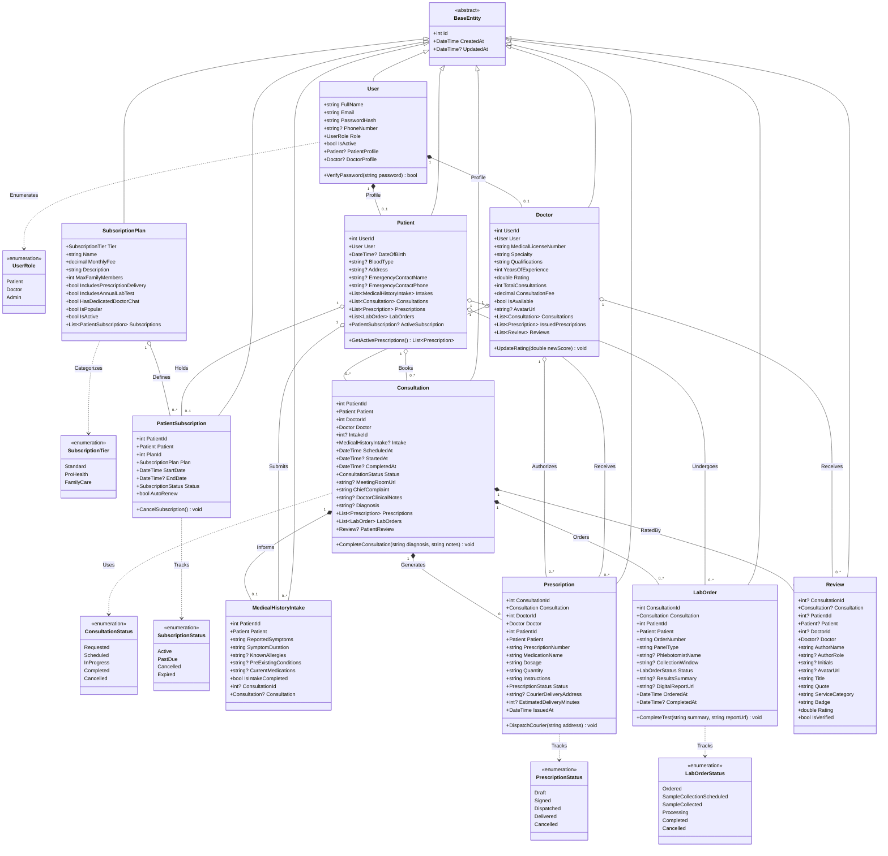

# MediConsult — Domain Class Diagram & Architecture Specification 🩺✨

> **Course:** CSIT321 - Lab Activity: Class Diagram & Initial Domain Models  
> **Platform:** MediConsult Virtual Telemedicine Platform  
> **Target Framework:** ASP.NET Core 8.0 (.NET 8) C#

---

## 📌 Executive Summary

This document presents the Object-Oriented Domain Class Diagram and structural specifications for **MediConsult**, a modern telemedicine and virtual healthcare web application. 

The domain models reflect the application's core user journeys:
1. **User Identity & Roles** (Patient, Doctor, Admin authentication)
2. **Clinical Intake & Assessment** (Pre-consultation symptom and allergy questionnaire)
3. **Telehealth Consultations** (Physician matching, video visit appointments, clinical encounter notes, and diagnosis)
4. **Prescription Management** (Digital e-Rx generation and doorstep courier delivery tracking)
5. **At-Home Diagnostic Orders** (Mobile phlebotomist scheduling and 24-hour digital lab results)
6. **Verified Patient Feedback** (Ratings, testimonials, and clinical review scores)
7. **Care Subscriptions** (Transparent tiered membership plans)

---

## 📐 Unified Class Diagram (Mermaid)



---

## 🏛️ Domain Model Specifications

### 1. Identity & User Profile Models
- **`User`**: Core account model storing credentials, email, password hash, role (`Patient`, `Doctor`, `Admin`), and system status.
- **`Patient`**: Medical demographic profile for patients. Links to their medical history intakes, consultations, active prescriptions, lab orders, and subscription tier.
- **`Doctor`**: Medical practitioner profile capturing medical license number, primary specialty, clinical credentials, consultation count, hourly/visit fee, and average clinical review score.

### 2. Clinical Workflow Models
- **`MedicalHistoryIntake`**: Captures patient symptoms (e.g., *"Sinus Pressure and Fever"*), duration (*"3 consecutive days"*), drug allergies (e.g., *"Penicillin"*), and pre-existing medical conditions prior to doctor matching.
- **`Consultation`**: Represents the live telehealth encounter. Tracks scheduled appointment times, status lifecycle (`Requested` ➔ `Scheduled` ➔ `InProgress` ➔ `Completed`), secure video room URL, doctor clinical encounter notes, and diagnosis.

### 3. Fulfillment & Service Delivery Models
- **`Prescription`**: Digital electronic prescription (e-Rx) signed by the physician. Details medication name (*"Amoxicillin 500mg"*), dosage, quantity (*"30 capsules"*), courier delivery address, and estimated doorstep arrival minutes.
- **`LabOrder`**: Diagnostic testing panel (e.g., *"CMP + CBC"*). Dispatches certified mobile phlebotomist to patient address and posts digital lab results within 24 hours.

### 4. Patient Engagement & Testimonials
- **`Review`**: Real patient feedback corresponding to the `/reviews` showcase and landing page testimonial cards. Captures rating (1.0 to 5.0), testimonial quote, service category (*"Urgent Telehealth"*, *"Doorstep Prescriptions"*, *"Home Doctor Visit"*), and verified patient badge.

### 5. Pricing & Subscription Plans
- **`SubscriptionPlan`**: Catalog of membership tiers matching `#pricing`:
  - **Standard ($0/mo)**: Pay-as-you-go doctor visits, basic triage chat.
  - **Pro Health ($29/mo)**: Unlimited telehealth consults, free prescription delivery, 24/7 care team chat, annual lab test.
  - **Family Care ($59/mo)**: Up to 4 family members, quarterly checkups, emergency helpline.
- **`PatientSubscription`**: Active patient enrollment tracking billing cycles and renewal status.

---

## 📂 Physical Project Structure

All initial C# models are implemented in `medconsult/Models/`:

```text
medconsult/
├── Models/
│   ├── Common/
│   │   └── BaseEntity.cs                 # Base entity (Id, CreatedAt, UpdatedAt)
│   ├── Enums/
│   │   └── DomainEnums.cs                # UserRole, ConsultationStatus, PrescriptionStatus, etc.
│   ├── Users/
│   │   ├── User.cs                       # Account identity
│   │   ├── Patient.cs                    # Patient medical profile
│   │   └── Doctor.cs                     # Practitioner credentials & rating
│   ├── Clinical/
│   │   ├── MedicalHistoryIntake.cs       # Pre-consultation intake form
│   │   ├── Consultation.cs               # Telehealth encounter & video visit
│   │   ├── Prescription.cs               # e-Rx and doorstep delivery
│   │   └── LabOrder.cs                   # At-home lab diagnostic order
│   ├── Engagement/
│   │   └── Review.cs                     # Testimonial & clinical rating
│   └── Billing/
│       ├── SubscriptionPlan.cs           # Pricing tier catalog
│       └── PatientSubscription.cs        # Patient subscription enrollment
```

---

## 🔗 Submission References
- **Mermaid Diagram:** Embedded above for instant viewing on GitHub or pasting directly into draw.io.
- **Repository Root:** [MediConsult Repository](https://github.com/renzo1417/MediConsult)
- **Models Directory:** [MediConsult Models](https://github.com/renzo1417/MediConsult/tree/main/Models)

